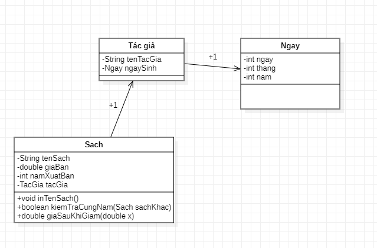

Xây dựng một ứng dụng Java quản lý những quyển sách với những thông tin sau :
SÁCH  bao gồm <i>Tên sách, giá bán, năm xuất bản và tác giả</i>. Tác giả bao gồm các thông tin là tên, ngày sinh. Ngày sinh bao gồm các thông tin là ngày tháng năm

-- Viết các phương thức:
- In ra màn hình tên của một quyển sách
- Cho kiết quyển sách bất kì có được xuất bản cùng năm với một quyển sách nào đó hay kg
- Cho biết giá sách đó sau khi giảm giá x%, x được truyền như một tham số. 
